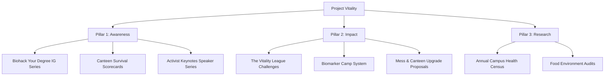

# Project Vitality: Organizational Charter & Strategic Pillars

## 1. What is Project Vitality?

Project Vitality is a student-led, non-profit initiative dedicated to improving the actual, physiological health biomarkers of college students. Our focus is on internal biological metrics—such as lipid profiles, fasting blood glucose (HbA1c), sleep architecture, resting heart rate, cortisol, and micronutrient levels (Vitamin D/B12)—rather than superficial, gym-bro physical aesthetics.

Originating at Sri Venkateswara College (SVC), Delhi University (DU), the organization is designed to operate under three severe constraints:
1.  **Zero Budget**: No membership fees or operational funds. All incentives and rewards are secured via sponsorship trades (e.g., local print shops, PG owners, and cafes in Satya Niketan).
2.  **Time Poverty**: Student volunteers are full-time academics. Execution models must be simple, low-effort, and sustainable.
3.  **Cultural Bias**: Traditional health initiatives are perceived as preachy or uncool. Vitality frames wellness as "cognitive and athletic performance biohacking" using humor, social media gamification, and peer influence.

---

## 2. Strategic Pillars

Our actions are divided into three core pillars based on the degree of engagement required from the student body:

---

### Pillar 1: Awareness (Attention-Only Platform)
*   **Essence**: *Low-barrier cognitive framing. Shifting health from a preachy lifestyle chore to a performance-oriented 'biohack' (optimizing GPA, sleep, and physical recovery) through modern social media formats, requiring nothing from the audience but their passive attention.*
*   **"Biohack Your Degree" Instagram Series**: A recurring digital content series providing micro-lessons on performance-based health (e.g., circadian sleep habits, sodium-retention bloat, caffeine half-life, and cortisol-mitigating breathing protocols).
*   **"Canteen Survival Scorecards" (Digital Guide)**: A digital menu scoring matrix that grades campus dishes on a "Vitality Index" (protein density, sodium impact, and glycemic index), letting students make informed decisions at a glance.
*   **"The Activist Keynotes" Series**: A recurring speaker platform partnering with online wellness creators, student sports leaders, and local doctors to deliver short, engaging talks on stress management and dietary hacks.

---

### Pillar 2: Impact (Actionable Interventions)
*   **Essence**: *Active behavioral conversion. Driving direct, measurable updates to student biomarker trends and the campus environment by negotiating institutional food swaps or organizing gamified peer-to-peer competitions and diagnostics.*
*   **"The Vitality League" (Gamified Challenges)**: A monthly competition framework where student departments or hostel wings compete. Challenges rotate between physical tracking (e.g., step sprints), sleep improvement (e.g., screens-off bedtime verification), and hydration check-ins. Rewards are sponsored by local Satya Niketan cafes or print shops.
*   **"Vitality Desk" Biomarker Camp System**: A standard operating package that brings local diagnostic labs onto the college campus to host high-discount, low-friction biomarker blood screening drives. Students pay the labs directly at a discounted rate, while organizers maintain strict data privacy compliance by never handling student health files.
*   **Mess & Canteen Upgrade Proposals**: A structured playbook presented to canteen vendors and hostel mess wardens containing pre-formulated, budget-neutral recipe upgrades, ingredient swaps (e.g., lower sodium, healthier oils), and high-protein additions.

---

### Pillar 3: Research (Institutional Analytics)
*   **Essence**: *Empirical proof-of-concept. Gathering college-specific baseline metrics throughout the year to build a localized data set, providing the scientific leverage needed to lobby the college administration and mess vendors for policy modifications.*
*   **The Annual Campus Health Census**: An ongoing, slang-friendly survey mapping sleep quality, caffeine dependency, PG dietary deficits, and student fatigue to build a localized health database.
*   **Food Environment Audits**: Continuous observational studies of food sales within campus boundaries and local PG housing conditions to trace the connection between environment and student biological metrics.
